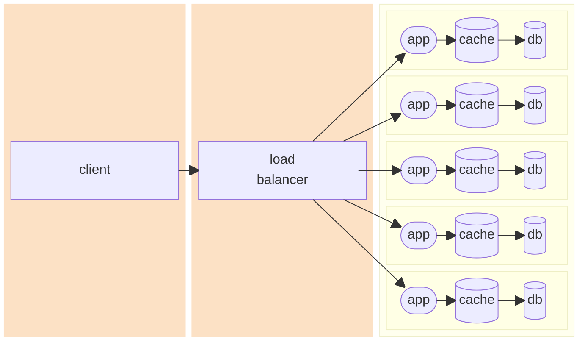

## Without Side Effects

First we show that what I will call the "canonical" recursive implementation of the Fibonacci sequence is terribly slow.
It duplicates an _enormous_ amount of work.

Start up the application by opening a terminal and running:

```shell
✗ make single-instance
```

```shell
✗ time curl -sX 'GET' 'http://localhost:8080/fibonacci/slow/35'  | jq '.'
{
  "result": 9227465,
  "callCount": 18454928,
  "cached": false,
  "host": "89f3a297fc1d"
}
curl -sX 'GET' 'http://localhost:8080/fibonacci/slow/35'  0.01s user 0.00s system 0% cpu 39.489 total
jq '.'  0.02s user 0.00s system 0% cpu 39.489 total
```

Next, we should that using {{page.cacheable}} to mimoize a recursive function _greatly_ reduces the duplicated work done
by the "canonical" implementation.

```shell
✗ time curl -sX 'GET' 'http://localhost:8080/fibonacci/fast/35'  | jq '.'
{
  "result": 9227465,
  "callCount": 34,
  "cached": false,
  "host": "89f3a297fc1d"
}
curl -sX 'GET' 'http://host:8080/fibonacci/fast/35'  0.01s user 0.00s system 14% cpu 0.042 total
jq '.'  0.03s user 0.00s system 60% cpu 0.042 total
```

Next, we show that using {{page.cacheable}} to cache the final return value of the function makes even _less_ work for
us on
successive calls.

```shell
✗ curl -sX 'GET' 'http://host:8080/books'  | jq -c '.[] | {isbn, title}'
{"isbn":"0130305529","title":"On Lisp"}
{"isbn":"0923891579","title":"Introduction to Meta-Mathematics"}
{"isbn":"1640781684","title":"Pathfinder - Core Rulebook"}
```

```shell
✗ time curl -sX 'GET' 'http://host:8080/fibonacci/fast/35'  | jq '.'
{
  "result": 9227465,
  "callCount": 0,
  "cached": true,
  "host": "89f3a297fc1d"
}
curl -sX 'GET' 'http://host:8080/fibonacci/fast/35'  0.01s user 0.00s system 65% cpu 0.010 total
jq '.'  0.03s user 0.00s system 99% cpu 0.025 total
```

There are some non-obvious fields on the objects our API returns. We can ask the API what they are[^jqshowoff]:

```shell
✗ curl -s http://localhost:8080/v3/api-docs \
| jq '.components.schemas."FibonacciResult".properties' \
| jq 'to_entries' \
| jq 'reduce .[] as $i ({}; .[$i.key] += ($i.value * {"field": $i.key}))' \
| jq '.["callCount", "host", "cached"]' \
| jq -c '{field, description}'

{"field":"callCount","description":"The number of intermediate, recursive calls made to obtain this result."}
{"field":"host","description":"Which host serviced the request that provided this value?"}
{"field":"cached","description":"Was this value retrieved from the cache?"}
```

### Single JVM

The only examples of Spring declarative caching I found online were those of the most simple case: a single JVM. This
case is pretty easy to reason about, but it seems hard for me to imagine
an example of where it would be useful in the modern world of distributed applications.

### Multiple JVMs

Nowadays, microservices are all the rage. It's VERY common to come across a distributed application that runs in
multiple JVMs. This was exactly the concern I had
with using {{page.cacheable}}.

```shell
✗ curl -s http://host:8080/books/clear; for i in {1..6}; do curl -s http://host:8080/books/0130305529 | jq -c
 
{"host":"0e7b8a14bd32","cached":false}
{"host":"7b9a2ba6757a","cached":true}
{"host":"44b88b21d5ad","cached":true}
{"host":"bd96ee2ec401","cached":true}
{"host":"e7d40c130569","cached":true}
{"host":"0e7b8a14bd32","cached":true}
```

```shell
./gradlew bootRun
```

```shell
curl -s http://localhost:8080/books | jq -c '.[]'
```

```json
{
  "isbn": "0130305529",
  "title": "On Lisp",
  "author": "Paul Graham"
}
{
  "isbn": "0923891579",
  "title": "Introduction to Meta-Mathematics",
  "author": "Stephen Cole Kleene"
}
{
  "isbn": "1640781684",
  "title": "Pathfinder - Core Rulebook",
  "author": "Jason Bulmahn"
}
```

```shell
curl -s http://localhost:8080/books/0130305529 | jq -c '.'
```

```json
{
  "isbn": "0130305529",
  "title": "On Lisp",
  "author": "Paul Graham"
}
```

```shell
curl -s http://localhost:8080/books/0130305529/badUpdateTitle/Onto%20Lisp | jq -c '.'
curl -s http://localhost:8080/books/0130305529 | jq -c '.'                           
```

Cache wasn't updated!

```jsonc
{"isbn":"0130305529","title":"On Lisp","author":"Paul Graham"}
```
